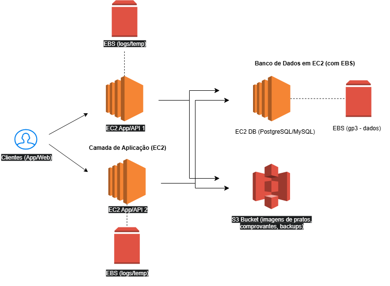

# ☁️ Amazon EC2 (Elastic Compute Cloud)

## 📌 O que é?
O **Amazon EC2** é um serviço da AWS que fornece **servidores virtuais escaláveis na nuvem**, chamados de *instâncias*.  
Com ele, você pode criar e configurar máquinas virtuais sob demanda, escolher o sistema operacional, tamanho de hardware, armazenamento e rede.  
O pagamento é feito apenas pelo tempo e recursos que você realmente utiliza.

---

## 🔹 Conceitos principais

### 1. Instância EC2
- É o "computador virtual" na nuvem.  
- Roda sistemas operacionais Linux ou Windows.  

### 2. AMI (Amazon Machine Image)
- É a **imagem base** usada para criar instâncias.  
- Define o sistema operacional e softwares pré-instalados.  
- Permite criar várias máquinas idênticas de forma rápida.  

### 3. Tipos de instância
- **T2/T3** → Uso geral.  
- **C5** → Computação intensiva.  
- **M5** → Balanceado.  
- **P/G** → Machine Learning, GPU.

- **Como escolher a máquina?** → Observar a aplicação do sistema e adequar com custo e processamento eficientes, garantindo menor gasto com estabilidade e disponibilidade necessárias.
  - [AWS Pricing Calculator](https://calculator.aws/)

### 4. Armazenamento
- **EBS (Elastic Block Store)**: disco virtual persistente, como um HD/SSD ligado ao EC2.  
- **Instance Store**: armazenamento temporário (dados se perdem ao desligar a instância).  
- **S3 (Simple Storage Service)**: armazenamento de objetos, barato e altamente durável.  

### 5. Snapshots
- São **backups/pontos de restauração** de volumes EBS.  
- Podem ser usados para duplicar ou restaurar volumes.  

---

## 🔹 Ciclo de uso do EC2
1. Escolher uma **AMI** (imagem base).  
2. Selecionar o **tipo de instância** (CPU, memória, GPU, etc.).  
3. Configurar **armazenamento** (EBS, S3, etc.).  
4. Definir **rede e segurança** (grupos de segurança, acesso SSH/RDP).  
5. Iniciar a instância e usar como se fosse um computador real.  

---

## 🔹 Vantagens do EC2
- Escalabilidade automática.  
- Flexibilidade de sistemas e configurações.  
- Pagamento sob demanda.  
- Integração com outros serviços AWS.  

---

## 🔹 Boas práticas do EC2
- Desligar instâncias não-utilizadas
  - Ex: Máquinas para uso de desenvolvedores durante horário comercial são desligadas à noite
- Remover recursos ociosos
  - Ex: Haver uma demanda menor do que esperado, podendo cortar capacidade de processamento
- Escalar recursos
  - Ex: Haver uma demanda maior que a esperada, podendo contratar mais máquinas (horizontal) e/ou uma máquina mais potente (vertical).

---

## 🏗️ Exemplo de Arquitetura - Delivery

- EC2 App/API (x2): duas instâncias para alta disponibilidade rodando sua API e app web/mobile (Node, Python, etc.).
- EBS (nos apps): volumes anexados para logs e temporários (uploads antes de irem ao S3, cache local, etc.).
- EC2 DB: banco relacional autogerenciado (PostgreSQL/MySQL) em uma instância EC2 separada.
- EBS (no DB): volume gp3 para os dados do banco (IOPS/throughput ajustáveis).
- S3 Bucket: armazena imagens de pratos, recibos, exportações e backups (objetos estáticos, duráveis e baratos).

### Fluxo típico:

1. Cliente (app/web) chama a API nos EC2.
2. A aplicação lê/escreve no DB (EC2 + EBS).
3. Uploads de mídia vão do app para S3 (após um staging breve no EBS do app, se necessário).

---
## ☁️ Amazon Web Services como um computador

### EC2 (Elastic Compute Cloud)
→ É o computador virtual na nuvem que você aluga.

### EBS (Elastic Block Store)
→ É o HD/SSD desse computador, onde ficam o sistema e os arquivos.

### S3 (Simple Storage Service)
→ É o armário na nuvem usado para guardar arquivos de forma separada.

### AMI (Amazon Machine Image)
→ É o modelo/base (como um pendrive bootável) para criar novas máquinas virtuais EC2.

### Snapshot
→ É a foto/backup do disco (EBS), que permite restaurar dados ou clonar um HD.
